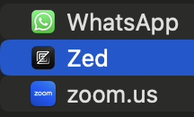

# Zero to Zed

Journal for learning Zed from scratch as it will be the editor of choice for some new Python AI projects.

## Table of Contents
- [Context](#context)
  - [Who TF?](#who-tf?)
  - [Why TF?](#why-tf?)
  - [What TF?](#what-tf?)
- [Happy Path for Zero to Zed](#happy-path-for-zero-to-zed)
  - [CLI](#1-cli)
  - [Settings](#2-settings)
  - [Extensions](#3-extensions)
  - [Languages, Formatting, Linting](#4-languages,-formatting,-linting)
  - [Multibuffers](#5-multibuffers)
  - [Outline Panel](#panels)
  - [Completions](#completions)
  - [Assistant](#assistant)
- [Happy Projects for Zero to Zed](#happy-projects-for-zero-to-zed)
  - [Simple Claude Test App](#simple-claude-test-app)
  - [Claude MCP](#claude-mcp)
  - [PydanticAI](#pydanticai)
  - [AI Agents](#ai-agents)
- [Happy People and Places for Zero to Zed](#happy-people-for-zero-to-zed)
  - [Reddit](#reddit)
  - [X](#x)
  - [Zed Community](#zed-community)
- [Happy Resources for Zero to Zed](#happy-resources-for-zero-to-zed)
  - [Zed YouTube Channels](#zed-youtube-channels)
  - [Zed Blogs](#zed-blogs)
  - [Zed Roadmap](#zed-roadmap)
- [Further Ideas for Zero to Zed](#futher-ideas-for-zero-tozed)

## Context

### Who TF?

This is of course, primarily, for you, Dear Reader. But the first Dear Reader is myself!
I'm writing this to help me learn Zed and many other other things: asking questions, documenting, and trying to explain stuff is how I learn. The benefit is to help others.

### Why TF?

I started using Zed in Dec 2024 on the brink of starting a bunch of projects (is that the collective noun for projects?). I'm was finding myself using VScode more and more... and it's becoming proper crufty... and confusing... and I wanted to reset. I've tried most IDEs over the 30 years (cough) but a fresh IDE on the block tickled my interest: Zed.

So, as an average programmer (I'm more a CTO type with 30 years experience doing all sorts) who has never used Zed and has a load of Python, LLM, and other projects to do: *Zed it is*, come what may.

### What TF?

I hate doing any tech without at least reading some of the docs. I like to find people that are part of the project. I like to read other user blogs and articles.

But most useful of all is to learn by doing, so here's what I did as a n00b:

1. Install all the stuff on my Macbook Air (not in this guide).
2. Read the features before I start playing (see Happy Features below).
3. Do the basic config as per the docs.
4. Do a simple Python / Anthropic program.
5. Write this up.
6. Consider what is next.

## Happy Features for Zero to Zed

As a long-time techie, I've worked on systems with, say, a 1,000 nobs and dials. And the best people know which fewest nobs and dials make the most impact. Some never get touched at all. I call this the *Happy Path*.

As a Zed n00b, I'm better placed than an expert Zed user to find this path because I don't have the curse of knowledge. I will, of course, make mistakes, often get lost, and occasionally blown up.

But here's my 8-step Zed n00b happy path in terms of groking Zed:

1. [CLI](#1-cli)
2. [Settings](#2-settings)
3. [Extensions](#3-extensions)
4. [Languages, Formatting, Linting](#4-languages,-formatting,-linting)
5. [Multibuffers](#5-multibuffers)
6. [Outline Panel](#outline-panel)
7. [Completions](#completions)
8. [Assistant](#assistant)

*What's not included in the happy path, because they're not for n00bs like me*

- Key bindings (if you're into this stuff, you're not a n00b).
- Debugger - there isn't one built-in at the moment, it's on the [Roadmap](#zed-roadmap)
- Github - Github help isn't built-in, you need to use the CLI. See [CLI](#cli).
- Themes are simple to use, but let's not talk about customizing/creating.

### 1 CLI

I swear the CLI was installed automagically on mine, but I might have just forget. But make sure you can do the following, if not, just use the Install CLI option in Zed.

Like "code .", just pop into your project folder and run the zed app with a cwd period:

`chamberz@Steves-Air zero2zed % zed .`

And of course you can always kick off the Zed app on a Max via Finder > Applications:



You have a built-in CLI terminal in Zed, just like VScode, via control + backtick or View menu.

There is no Github help built into the Zed IDE, so you need to make sure your terminal is setup properly for `git` and `gh` commands.

Make sure you know how to use Python envs. If you use venv like me, then when you kick off the Zed app from the CLI in a project folder with a venv activated: it will work it all out.

### 2 Settings

Zed settings on the Mac are in a $user/.config/zed directory. In settings.json, you can do your settings.

For n00bs this means you can't set all your settings in the IDE, you need to edit a file.

Once you make a setting, it's automatigically refreshed in the Zed app. You don't have to "reload" or "restart" or "try turning it off and on again".


*My first favourite settings*

As a n00b, I found these came first:

- Put a soft-wrap on the editor, so lines wrap to the editor width.
- Extensions like Ruff make their own changes.

My current n00b settings.json looks like this. I hand edited this to add the "soft_wrap" line.

```
// Zed settings
//
// For information on how to configure Zed, see the Zed
// documentation: https://zed.dev/docs/configuring-zed
//
// To see all of Zed's default settings without changing your
// custom settings, run `zed: open default settings` from the
// command palette (cmd-shift-p / ctrl-shift-p)
{
  "ui_font_size": 16,
  "soft_wrap": "editor_width",
  "buffer_font_size": 16,
  "theme": {
    "mode": "system",
    "light": "One Dark",
    "dark": "One Dark"
  }

}
```

### 3 Extensions

### 4 Languages, Formatting, Linting

### 5 Multibuffers

### 6 Panels

### 7 Completions

### 8 Assistant.

## Happy Projects for Zero to Zed

Python only in this

### Simple ClaudeAI Test App
CLaude AI example

### Claude MCP

Claude MCP coming next.

### PydanticAI

TBD

### AI Agents

TBD

## Happy People and Places for Zero to Zed

### Reddit

There's a sub for Zed! [Go to the ZedEditor Reddit sub](https://www.reddit.com/r/ZedEditor/
)

### X

Couldn't find an existing X community. Best I could do as a Zed n00b was start my own X list.

[Join the @4thWaveStevie Zedders list](https://x.com/i/lists/1865387653622862220)

People I've found so far (and will keep =adding!)

- [ZedDotDev official](https://x.com/zeddotdev)
- [Nathan Sobo, Zed founder](https://x.com/nathansobo)
- [Steve Chambers, Zed n00b](https://x.com/4thwavestevie)

### Zed Community

This [Zed Community Links page](https://zed.dev/community-links) has useful places to go:

- [Discord](https://discord.com/invite/qSDQ8VWc7k)
- [Github Discussions](https://github.com/zed-industries/zed/discussions)
- [Zed Channels](https://zed.dev/docs/channels#channels)

## Happy Resources for Zero to Zed

### Zed YouTube Channels

- [The official ZedDotDev Channel](https://www.youtube.com/@zeddotdev)

### Zed Blogs

- [The official ZedDotDev Blog](https://zed.dev/blog)
- [Ben Selby - Zed for a Week](https://benmatselby.dev/post/2024/working-with-zed/)

### Zed Roadmap

The offical [Zed Roadmap](https://zed.dev/roadmap).

## Futher Ideas for Zero to Zed
_Dec 7 2024_

Here's my rough n00b brainstorm of stuff to do to learn Zed through doing projects, and sharing.

1. Include X users who are helpful.
2. Find blogs that are helpful and NOT behind paywalls.
3. Draw a little tree of useful Zed online resources.
4. Draw a little tree of “happy path” useful Zed functions and features. Maybe colour code and beginner -> intermediate -> advanced?
5. Compare and contrast to VScode and Neovim (is it in the middle?)
6. Just link to install, don’t repeat (it’s easy).
7. Quick concierge tour of the IDE.
8. Extensions?
9. Set up for Python?
10. Set up with Claude IDE?
11. Markdown?
12. Set up for Github?
13. Set up on your laptop (local file structure – use a cloud service like iCloud).
14. Project examples?
15. Video content?
16. What blogs to write?
17. Create an all-on-one markdown file?
18. Schedule regular posts on X/LinkedIn.
19. Reddit group? https://www.reddit.com/r/ZedEditor/
